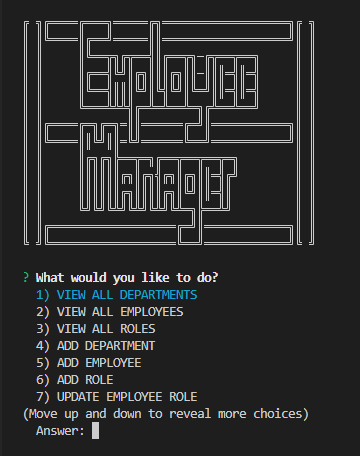
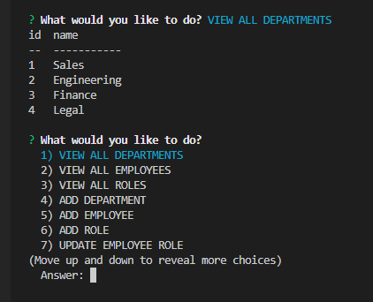
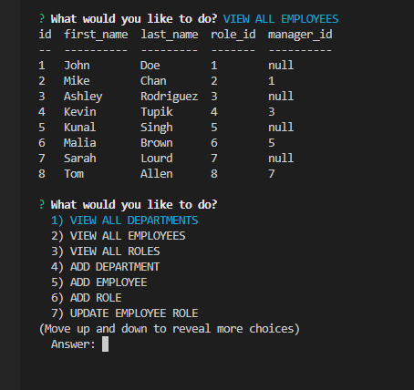
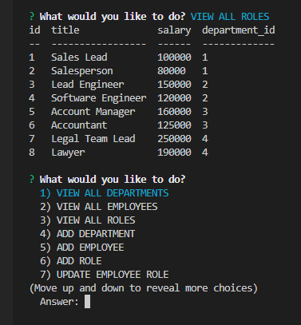
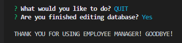

# SQL-Employee-Tracker

[Link to my profile](https://github.com/cujion)

## Table of Contents
- [Description](#description)
- [Visuals](#visuals)
- [Tests](#tests)
- [License](#license)


## Description
* This application is a MySQL driven database application. This application is ran completely in your terminal. Once started you are prompted with a nice Employee Manager drawn out along with a list of options on what you would like to do. The purpose being a neat, clean and simple way to store company data ie. departments, roles and employees within the company. You can view all departments, view all employees, view all roles, add a department, add employee, add role, update an employees role, delete a department, delete an employee or delete a role. Depending on which option you select you will be prompted with questions pertaining to that option. Finally, once you have everything the way you'd like it you can simply click the quit option where you will be asked if you are sure you're finished editing the database if so, you will be exited out the program and a nice message will be displayed in your terminal upon exit.

## Visuals






## Tests
``` Open application in your terminal
    Run npm install
    Run node server.js / npm start
```

## License
* MIT License

* Copyright (c) [2022]] [Christopher Bonime]

* Permission is hereby granted, free of charge, to any person obtaining a copy
of this software and associated documentation files (the "Software"), to deal
in the Software without restriction, including without limitation the rights
to use, copy, modify, merge, publish, distribute, sublicense, and/or sell
copies of the Software, and to permit persons to whom the Software is
furnished to do so, subject to the following conditions:

* The above copyright notice and this permission notice shall be included in all
copies or substantial portions of the Software.

* THE SOFTWARE IS PROVIDED "AS IS", WITHOUT WARRANTY OF ANY KIND, EXPRESS OR
IMPLIED, INCLUDING BUT NOT LIMITED TO THE WARRANTIES OF MERCHANTABILITY,
FITNESS FOR A PARTICULAR PURPOSE AND NONINFRINGEMENT. IN NO EVENT SHALL THE
AUTHORS OR COPYRIGHT HOLDERS BE LIABLE FOR ANY CLAIM, DAMAGES OR OTHER
LIABILITY, WHETHER IN AN ACTION OF CONTRACT, TORT OR OTHERWISE, ARISING FROM,
OUT OF OR IN CONNECTION WITH THE SOFTWARE OR THE USE OR OTHER DEALINGS IN THE
SOFTWARE.